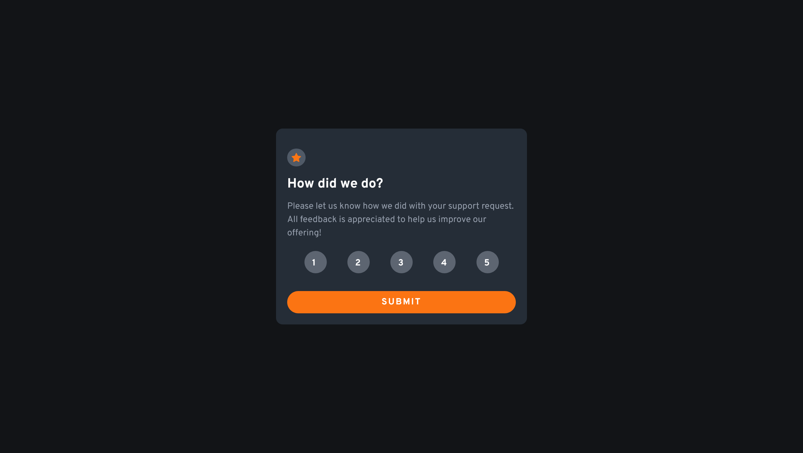
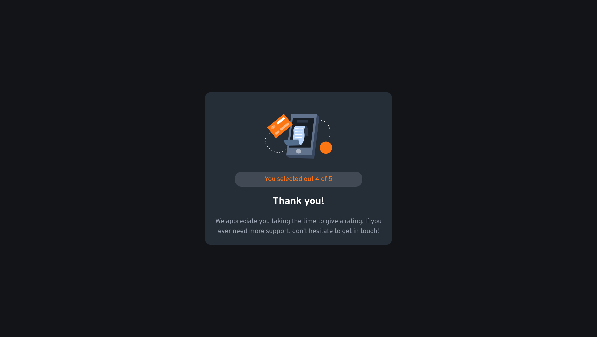

# Frontend Mentor - Interactive rating component solution

This is a solution to the [Interactive rating component challenge on Frontend Mentor](https://www.frontendmentor.io/challenges/interactive-rating-component-koxpeBUmI). Frontend Mentor challenges help you improve your coding skills by building realistic projects. 

## Table of contents

- [Overview](#overview)
  - [The challenge](#the-challenge)
  - [Screenshot](#screenshot)
  - [Links](#links)
- [My process](#my-process)
  - [Built with](#built-with)
  - [What I learned](#what-i-learned)
- [Author](#author)

## Overview

### The challenge

Users should be able to:

- View the optimal layout for the app depending on their device's screen size
- See hover states for all interactive elements on the page
- Select and submit a number rating
- See the "Thank you" card state after submitting a rating

### Screenshot

>Selection

>Result

### Links
- Solution URL: [GitHub]([https://your-solution-url.com](https://github.com/humbl3LilaS/interactive-rating-component-main.git))
- Live Site URL: [Vercel](https://interactive-rating-component-main-ebncad57p-humbl3lalis.vercel.app/)

## My process

### Built with

- Semantic HTML5 markup
- Tailwind CSS
- Mobile-first workflow

### What I learned

- How to up Tailwind for my project
- Customize Tailwind class
- Map event listener to Options

## Author
> Pale Edelweiss
- Frontend Mentor - [@Humble LilaS](https://www.frontendmentor.io/profile/yourusername)

